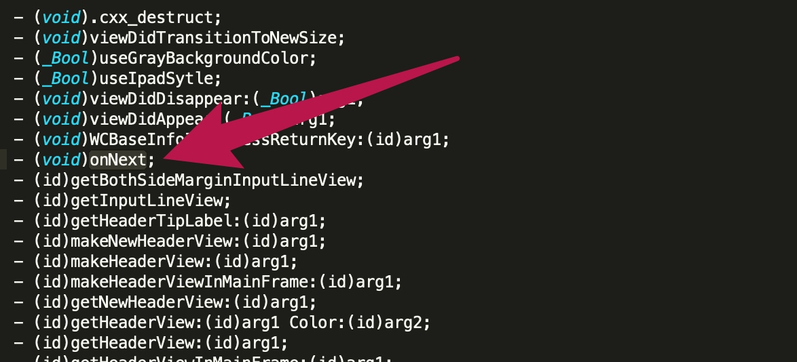

# Mach-O
Mach-O是Mach object的缩写，是Mac\iOS上用于存储程序、库的标准格式

## 常见的Mach-O文件类型

* MH_OBJECT
    * 目标文件（.o）
    * 静态库文件(.a），静态库其实就是N个.o合并在一起
* MH_EXECUTE：可执行文件
    * .app/xx
* MH_DYLIB：动态库文件
    * .dylib
    * .framework/xx
* MH_DYLINKER：动态链接编辑器
    * /usr/lib/dyld
* MH_DSYM：存储着二进制文件符号信息的文件
    * .dSYM/Contents/Resources/DWARF/xx（常用于分析APP的崩溃信息）
    
## Mach-O的基本结构

* 一个Mach-O文件包含3个主要区域
    * Header (文件类型、目标架构类型等 )
    * Load commands(描述文件在虚拟内存中的逻辑结构、布局 )
    * Raw segment data（在Load commands中定义的Segment的原始数据 ）

## 查看Mach-o结构

* 命令行工具
    * file：查看Mach-O的文件类型
        * `file  文件路径`
        
* otool：查看Mach-O特定部分和段的内容

* lipo：常用于多架构Mach-O文件的处理
    * 查看架构信息：`lipo  -info  文件路径`
    * 导出某种特定架构：`lipo  文件路径  -thin  架构类型  -output  输出文件路径`
    * 合并多种架构：`lipo  文件路径1  文件路径2  -output  输出文件路径`
* GUI工具
    * MachOView（https://github.com/gdbinit/MachOView）

## 脱壳

上传到App Store的应用一般苹果会对可执行文件进行改变（比如压缩、加密），以达到保护程序的目的
所谓脱壳就是摘掉壳程序，将未加密的可执行文件还原出来，也可称为砸壳

常见的脱壳工具：

* Clutch：https://github.com/KJCracks/Clutch
* dumpdecrypted：https://github.com/stefanesser/dumpdecrypted/
* AppCrackr、Crackulous（基本不用，常用前两种）

## 如何验证可执行文件是否已经脱壳？

* 将可执行的`Mach-o`文件拖入`Hopper Disassembler v4`当中 查看`Load Commands -> LC_ENCRYPTION_INFO -> Crypt ID`的值，`0`代表未加密
* 通过`otool`命令行也可以：`otool -l 可执行文件路径 | grep crypt`

最简单的方式是通过PP助手直接下载越狱包。。。。。。。

    
## class-dump

顾名思义，它的作用就是把Mach-O文件的class信息给dump出来（把类信息给导出来），生成对应的.h头文件

* 官方地址：http://stevenygard.com/projects/class-dump/
* 下载完工具包后将class-dump文件复制到Mac的/usr/local/bin目录，这样在终端就能识别class-dump命令了

常用格式：

* `class-dump -H Mach-O文件路径 -o 头文件存放目录`
    * -H表示要生成头文件
    * -o用于制定头文件的存放目录

    
## 简单了解iOS编译过程

`Objective C`采用`Clang`作为前端，而`Swift`则采用`swift()`作为前端，二者`LLVM(Low level vritual machine)`作为编译器后端。所以简单的编译过程如图
    
* 编译器前端：编译器前端的任务是进行：语法分析，语义分析，生成中间代码`(intermediate representation )`。在这个过程中，会进行类型检查，如果发现错误或者警告会标注出来在哪一行。

* 编译器后端：编译器后端会进行机器无关的代码优化，生成机器语言，并且进行机器相关的代码优化。iOS的编译过程，后端的处理如下：LVVM优化器会进行BitCode的生成，链接期优化等等。

参考链接：[点击 Run 之后发生了什么？](https://www.jianshu.com/p/d5cf01424e92)

## 示例

